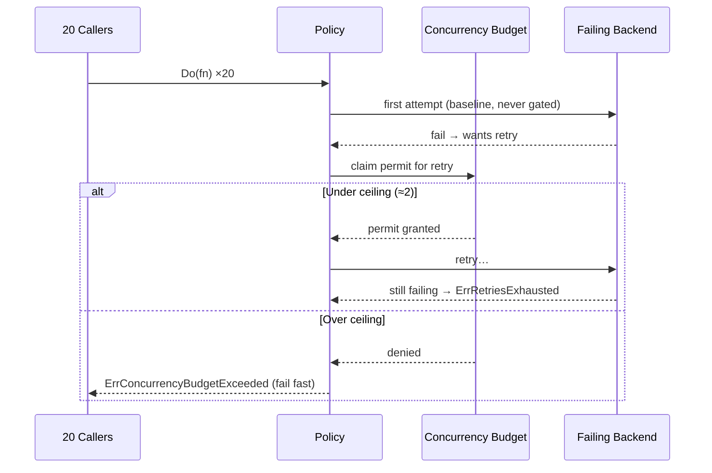

*[Lire en Français](README.fr.md)*

# Example 33 — Concurrency Budget

Demonstrates `WithConcurrencyBudget`, which caps how many retries (and hedges)
may be in flight **at once** — as a fraction of live traffic with a floor — so a
retry storm can't pile concurrent load onto a backend that is already failing.

## What it demonstrates

When a dependency fails, every caller retries at the same instant, multiplying
the load on the exact service that is already struggling — the classic retry
storm that turns a blip into an outage. A concurrency budget is the
concurrency-dimension complement of the retry budget (which throttles the retry
*rate* over time): it admits only a bounded share of retries concurrently and
fails the rest fast.

The example fires 20 concurrent calls at a failing downstream:

1. Each call's **first attempt is the baseline** — never gated — so all 20 fail
   together and all want to retry in the same instant.
2. The budget permits a retry only while
   `concurrent < max(MinConcurrency, MaxRatio × in-flight)`. With the tight
   `MaxRatio(0.1)` / `MinConcurrency(2)` here, that ceiling is ~2 concurrent
   retries.
3. Calls over the ceiling fail fast with **`ErrConcurrencyBudgetExceeded`**
   (deflecting load); calls that won a permit but kept failing exhaust their
   retries with `ErrRetriesExhausted`. The two outcomes are counted separately.
4. Shedding is load protection, not a fault — the policy stays **healthy and
   ready**, so an orchestrator won't kill a working instance mid-storm.

## How it works



## Key concepts

| Concept | Detail |
|---|---|
| `WithConcurrencyBudget(MaxRatio, MinConcurrency)` | Caps concurrent retries/hedges; inert without `WithRetry` or `WithHedge` (else panics in `NewPolicy`) |
| `MaxRatio(0.1)` | Ceiling scales with live traffic — a busier service tolerates more concurrent retries |
| `MinConcurrency(2)` | Floor so a low-traffic service can still retry at all |
| First attempt | The baseline; never gated. Only retries and the hedge attempt claim a permit |
| `ErrConcurrencyBudgetExceeded` | Returned when a retry is shed (wraps the last downstream error) |
| `OnConcurrencyBudgetExceeded` hook / `ConcurrencyBudgetExceeded`, `ConcurrencyBudgetInUse` metrics | Observe shedding and live permit usage |
| `HealthStatus()` | Stays healthy under shedding — readiness is unaffected |

## When to use

- Any service that retries against a shared dependency, where a correlated
  failure would otherwise trigger a synchronized retry storm.
- To bound the *parallelism* of retries (use alongside the retry budget to also
  bound their rate over time).
- High-fan-out paths where many goroutines could retry the same failing call at
  once and amplify the outage.

## Run

```bash
go run ./examples/33-concurrency-budget/
```

## Expected output

A storm section reports the 20 concurrent calls, how many retries the budget
shed, how many calls exhausted their retries, and how many times the
`OnConcurrencyBudgetExceeded` hook fired. An observability section prints the
shed counter, current permits in use (0 once the storm drains), and the health
state — showing the policy is still healthy. Exact split between shed and
exhausted counts varies with goroutine scheduling.
