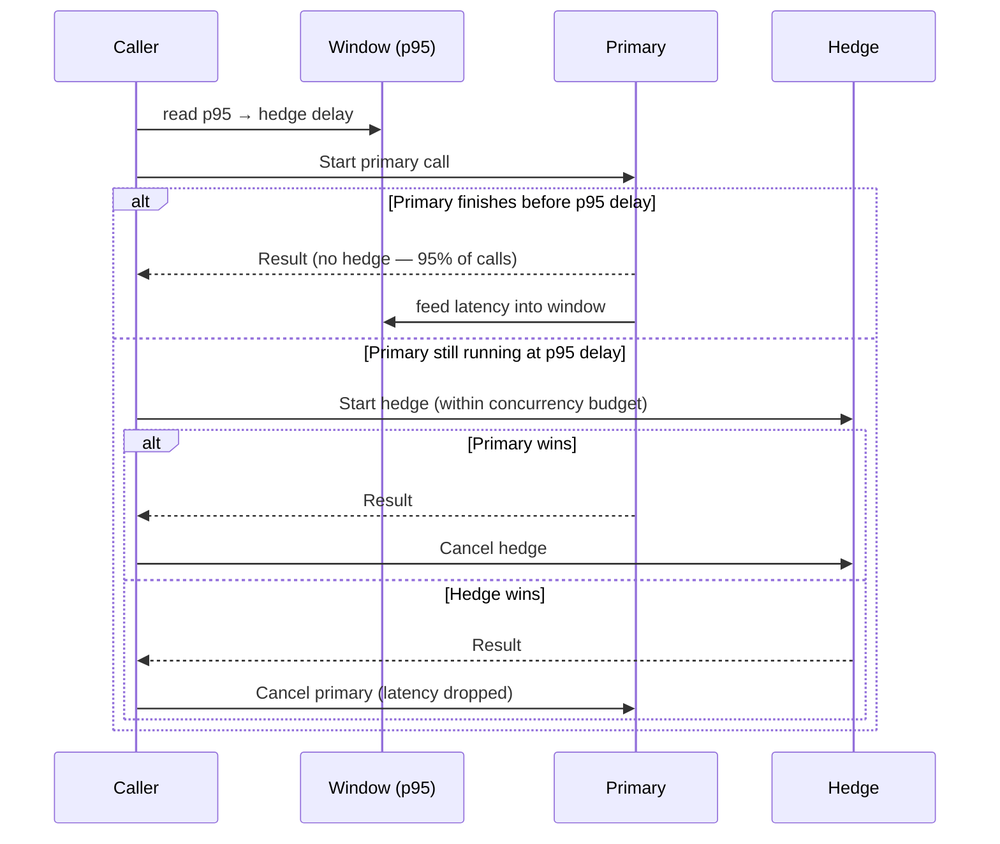

*[Read in English](README.md)*

# Exemple 36 — Délai de hedge adaptatif

Illustre un délai de hedge adaptatif piloté par percentile qui lance la seconde
tentative concurrente au p95 récent du backend lui-même, de sorte que seuls les
véritables traînards sont mis en course au lieu de doubler la charge sur chaque
appel.

## Ce que cet exemple illustre

Une politique est configurée avec `WithHedge(500ms, AdaptiveHedge(...))` plus un
budget de concurrence. Une fois suffisamment d'appels réussis observés :

1. Le délai de hedge est calculé à partir d'une fenêtre glissante de latences
   **primaires** récentes selon `clamp(p95 × multiplicateur, plancher, plafond)`.
2. Le `500ms` passé à `WithHedge` devient le **plafond** dur et le repli de
   préchauffage — la valeur adaptative ne peut qu'avancer le hedge, jamais le
   retarder.
3. Le backend est habituellement à ~10 ms mais ~4 % des appels sont des
   traînards à 300 ms (sous le p95). Le hedge se déclenche juste après le p95,
   donc les 95 % rapides ne paient aucun coût redondant et seule la queue lente
   est mise en course.
4. `WithConcurrencyBudget` plafonne la charge supplémentaire — au plus 25 % des
   exécutions en vol peuvent être des hedges — pour qu'un backend lent ne soit
   pas amplifié en surcharge.

Seule la complétion de la tentative **primaire** alimente la fenêtre. Un hedge
gagnant annule le primaire, dont la latence censurée est écartée : un hedge ne
peut donc jamais tirer vers le bas le percentile même qui a fixé son délai.

## Fonctionnement



## Concepts clés

| Concept | Détail |
|---|---|
| `WithHedge(plafond, AdaptiveHedge(...))` | La durée est le plafond dur et le repli de préchauffage, pas le délai de fonctionnement |
| `AdaptiveHedgePercentile(0.95)` | Se déclenche au p95 — les 95 % les plus rapides terminent avant que le hedge ne démarre (règle « tail at scale » de Google) |
| `AdaptiveHedgeMultiplier(1.0)` | Déclenche exactement au p95 ; augmentez pour attendre plus loin dans la queue, baissez pour hedger plus tôt |
| `AdaptiveHedgeFloor(5ms)` | Borne inférieure pour qu'une rafale ultra-rapide ne réduise pas le délai à presque zéro |
| `WithConcurrencyBudget(MaxRatio, MinConcurrency)` | Borne la charge redondante que les hedges peuvent ajouter |
| `Metrics().AdaptiveHedgeDelay` | Le délai que la politique appliquerait actuellement |

## Quand l'utiliser

- Opérations en lecture seule ou idempotentes avec un rapport p99/p95 élevé, où
  quelques appels lents dominent la latence perçue par l'utilisateur.
- Backends où un délai de hedge fixe se déclencherait soit trop tôt (doublant la
  charge sur le chemin rapide courant) soit trop tard pour aider — laissez-le
  suivre le p95 en direct.
- À toujours associer à un budget de concurrence pour que les hedges ne puissent
  pas amplifier la charge sur un backend déjà en difficulté.

## Exécution

```bash
go run ./examples/36-adaptive-hedge/
```

## Sortie attendue

Après le préchauffage : le p95 observé (~10 ms), le délai de hedge adaptatif
(noté « was a 500ms ceiling »), et le nombre de hedges déclenchés et gagnés. La
sortie varie car les traînards tombent aléatoirement.
