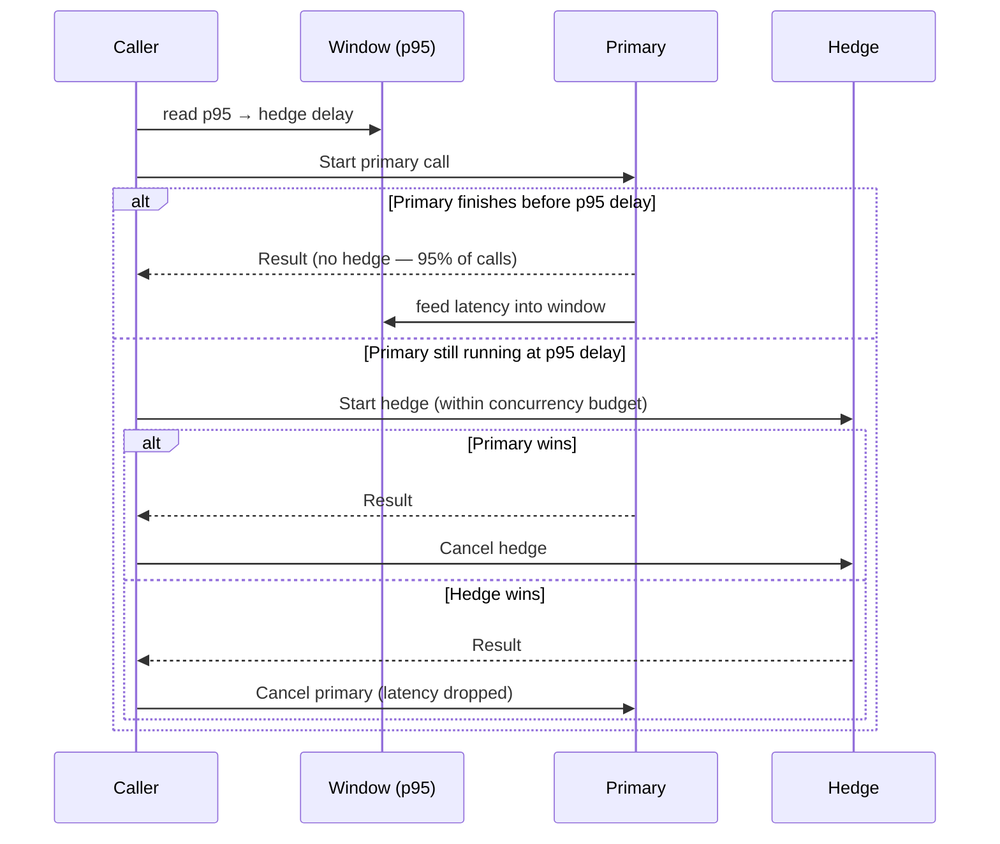

*[Lire en Français](README.fr.md)*

# Example 36 — Adaptive Hedge Delay

Demonstrates a percentile-driven adaptive hedge delay that fires the second
concurrent attempt at the backend's own recent p95, so only genuine stragglers
are raced instead of doubling load on every call.

## What it demonstrates

A policy is configured with `WithHedge(500ms, AdaptiveHedge(...))` plus a
concurrency budget. Once enough successful calls have been seen:

1. The hedge delay is computed from a sliding window of recent **primary**
   latencies as `clamp(p95 × multiplier, floor, ceiling)`.
2. The `500ms` passed to `WithHedge` becomes the hard **ceiling** and warmup
   fallback — the adaptive value can only pull the hedge earlier, never later.
3. The backend is usually ~10ms but ~4% of calls are 300ms stragglers (below
   the p95). The hedge fires just past the p95, so the fast 95% pay no redundant
   cost and only the slow tail is raced.
4. `WithConcurrencyBudget` caps the extra load — at most 25% of in-flight
   executions may be hedges — so a slow backend can't be amplified into overload.

Only the **primary** attempt's completion feeds the window. A winning hedge
cancels the primary, whose censored latency is dropped, so a hedge can never bias
down the very percentile that set its delay.

## How it works



## Key concepts

| Concept | Detail |
|---|---|
| `WithHedge(ceiling, AdaptiveHedge(...))` | The duration is the hard ceiling and warmup fallback, not the operating delay |
| `AdaptiveHedgePercentile(0.95)` | Fires at the p95 — the fastest 95% finish before the hedge would ever start (Google's tail-at-scale rule) |
| `AdaptiveHedgeMultiplier(1.0)` | Fire exactly at the p95; raise to wait deeper into the tail, lower to hedge more eagerly |
| `AdaptiveHedgeFloor(5ms)` | Lower bound so an ultra-fast burst can't drive the delay to near-zero |
| `WithConcurrencyBudget(MaxRatio, MinConcurrency)` | Bounds the redundant load the hedges can add |
| `Metrics().AdaptiveHedgeDelay` | The delay the policy would currently apply |

## When to use

- Read-only or idempotent operations with a high p99/p95 ratio, where a few slow
  calls dominate user-visible latency.
- Backends where a fixed hedge delay would either fire too eagerly (doubling load
  on the common fast path) or too late to help — let it track the live p95.
- Always pair with a concurrency budget so the hedges can't amplify load on a
  backend that is already struggling.

## Run

```bash
go run ./examples/36-adaptive-hedge/
```

## Expected output

After the warmup: the observed p95 (~10ms), the adaptive hedge delay (noted as
"was a 500ms ceiling"), and the counts of hedges triggered and won. Output
varies because the stragglers land randomly.
