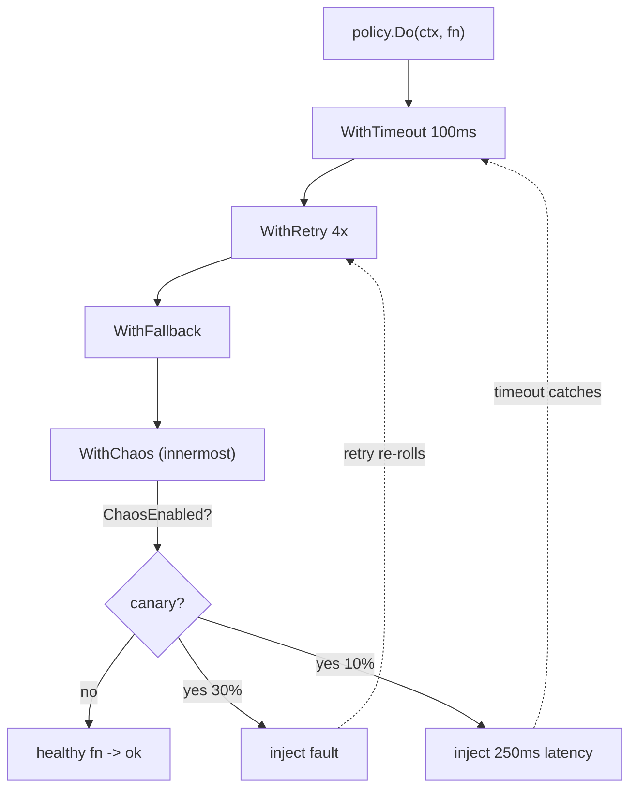

*[Read in English](README.md)*

# Exemple 37 — Injection de chaos

Illustre l'injection de chaos façon Polly-v8 / Simmy : perturber délibérément un
appel pour que les **propres** patterns de résilience de la politique soient mis à
l'épreuve, en cantonnant ce chaos à une cohorte canari afin qu'il soit sûr à
exécuter en production.

## Ce que cet exemple illustre

Le service en aval est parfaitement sain. Chaque panne et chaque ralentissement de
l'exécution est fabriqué par `WithChaos`, qui se place au point le **plus
interne** de la chaîne — un service en aval défaillant simulé. La politique
enveloppe le retry, le timeout et le fallback autour de lui, puis 200 appels
canari prouvent que ces patterns réagissent :

1. `ChaosFault(0.3, …)` fait échouer ~30 % des appels canari. Le **retry**
   (4 tentatives) re-tire le chaos à chaque tentative, donc la plupart de ces
   pannes sont absorbées et l'appel finit par réussir.
2. `ChaosLatency(0.1, 250ms, …)` bloque ~10 % des appels canari au-delà du
   **timeout de 100 ms**. Le timeout se déclenche et le **fallback** sert une
   valeur par défaut.
3. La panne est listée **avant** la latence : ainsi, quand la panne se déclenche,
   elle court-circuite le reste et l'attente de latence est évitée (ordre
   recommandé par Polly).
4. Un second lot de 200 appels **non canari** s'exécute avec la porte fermée : le
   prédicat `ChaosEnabled` renvoie faux, donc rien n'est injecté même si les
   stratégies sont toujours configurées.

Résultat net : `calls that still errored` reste à **0**, car le retry a absorbé
les pannes et le fallback a couvert les timeouts — et le compteur de production
est **inchangé**, prouvant que la porte canari tient.

## Fonctionnement



## Concepts clés

| Concept | Détail |
|---|---|
| `WithChaos(...)` | Insère les stratégies de chaos au point le plus interne de la chaîne — un substitut de service en aval défaillant |
| `ChaosFault(prob, err)` | Fait échouer une fraction des appels avec `err` ; court-circuite les stratégies restantes lorsqu'elle se déclenche |
| `ChaosLatency(prob, d)` | Retarde une fraction des appels de `d` (mesuré sur le `Clock` de la politique, donc déterministe en test) |
| `ChaosEnabled(pred)` | Conditionne une stratégie par appel en lisant le contexte — la base d'un chaos limité au canari sans redéploiement |
| `OnChaosInjected` / `ChaosInjected` | Hook (avec le type de stratégie) et compteur pour observer précisément ce qui a été injecté |
| Ordre des stratégies | Les stratégies s'exécutent dans l'ordre donné ; une panne ou un outcome court-circuite le reste, donc placez les pannes avant la latence |

## Quand l'utiliser

- Valider qu'une configuration retry/timeout/fallback réagit réellement à
  l'échec, avant que la production ne le prouve à la dure.
- Game days et tests de résilience continus où l'on veut une source d'échec
  probabiliste et contrôlable intégrée au chemin d'appel.
- Chaos canari en production — conditionner les stratégies avec `ChaosEnabled`
  pour que seule une petite cohorte balisée soit perturbée tandis que le reste de
  la flotte reste intact.
- Opérations idempotentes ou en lecture seule, où re-tirer le chaos à chaque
  tentative est sans danger.

## Exécution

```bash
go run ./examples/37-chaos-injection/
```

## Sortie attendue

Deux lots de 200 appels. Le premier rapporte les comptes d'injection par type,
les retries qui ont absorbé les pannes, les timeouts qui ont rattrapé la latence,
les fallbacks servis et — surtout — **0** appel ayant encore échoué. Le second lot
montre le compteur de chaos **inchangé**, car la porte est fermée pour le trafic
non canari. Les comptes d'injection exacts varient d'une exécution à l'autre car
l'injection est probabiliste.
