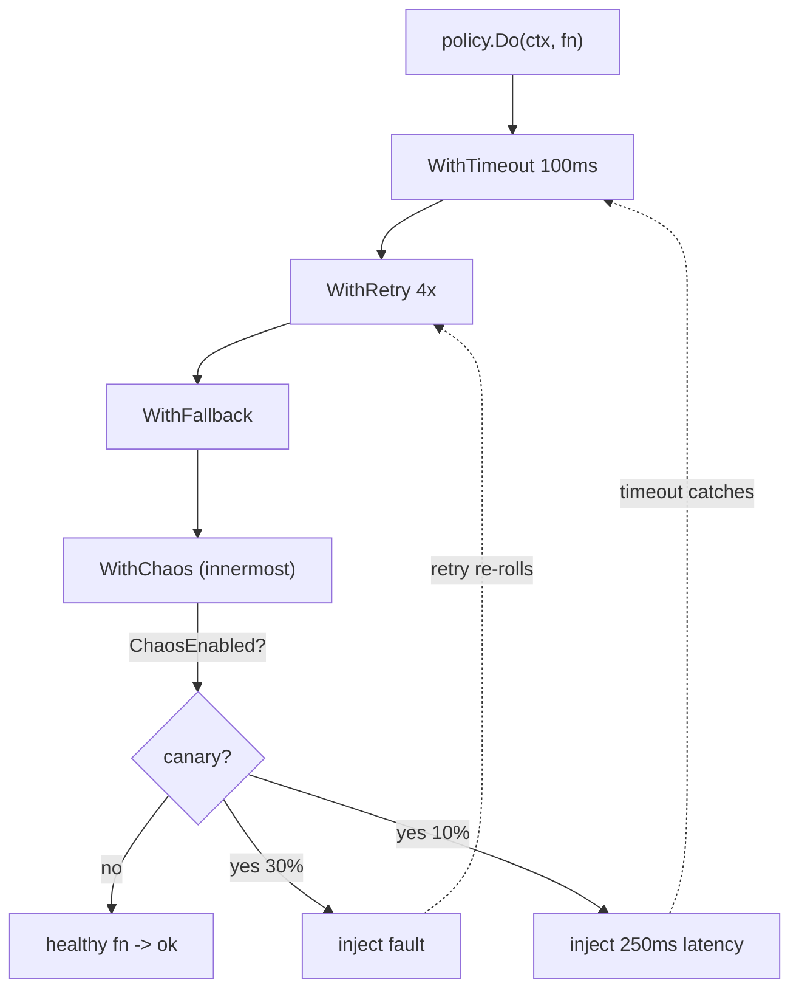

*[Lire en Français](README.fr.md)*

# Example 37 — Chaos Injection

Demonstrates Polly-v8 / Simmy-style chaos injection: deliberately disturbing a
call so the policy's **own** resilience patterns get exercised, and gating that
chaos to a canary cohort so it is safe to run in production.

## What it demonstrates

The downstream is perfectly healthy. Every fault and stall in the run is
manufactured by `WithChaos`, which sits at the **innermost** point of the chain —
a simulated misbehaving downstream. The policy wraps retry, timeout, and fallback
around it, then 200 canary calls prove those patterns react:

1. `ChaosFault(0.3, …)` fails ~30% of canary calls. **Retry** (4 attempts)
   re-rolls chaos on every attempt, so most of those faults are absorbed and the
   call still succeeds.
2. `ChaosLatency(0.1, 250ms, …)` hangs ~10% of canary calls past the **100ms
   timeout**. The timeout fires and the **fallback** serves a default value.
3. The fault is listed **before** the latency, so when the fault fires it
   short-circuits the rest and the latency wait is skipped (Polly's recommended
   order).
4. A second batch of 200 **non-canary** calls runs with the gate off: the
   `ChaosEnabled` predicate returns false, so nothing is injected even though the
   strategies are still configured.

The net result: `calls that still errored` stays at **0**, because retry soaked
up the faults and the fallback covered the timeouts — and the production counter
is **unchanged**, proving the canary gate holds.

## How it works



## Key concepts

| Concept | Detail |
|---|---|
| `WithChaos(...)` | Inserts chaos strategies at the innermost point of the chain — a stand-in for a misbehaving downstream |
| `ChaosFault(prob, err)` | Fails a fraction of calls with `err`; short-circuits the remaining strategies when it fires |
| `ChaosLatency(prob, d)` | Delays a fraction of calls by `d` (measured on the policy `Clock`, so it stays deterministic in tests) |
| `ChaosEnabled(pred)` | Gates a strategy per call by reading the context — the basis for canary-only chaos with no redeploy |
| `OnChaosInjected` / `ChaosInjected` | Hook (with strategy kind) and counter for observing exactly what was injected |
| Strategy order | Strategies run in the given order; a fault or outcome short-circuits the rest, so list faults before latency |

## When to use

- Validating that a retry/timeout/fallback config actually reacts to failure,
  before production proves it the hard way.
- Game days and continuous resilience testing where you want a controllable,
  probabilistic failure source built into the call path.
- Canary chaos in production — gate strategies with `ChaosEnabled` so only a
  small, flagged cohort is disturbed while the rest of the fleet is untouched.
- Idempotent or read-only operations, where re-rolling chaos on each retry is safe.

## Run

```bash
go run ./examples/37-chaos-injection/
```

## Expected output

Two batches of 200 calls. The first reports the per-kind injection counts, the
retries that absorbed faults, the timeouts that caught latency, the fallbacks
served, and — crucially — **0** calls that still errored. The second batch shows
the chaos counter **unchanged**, because the gate is off for non-canary traffic.
The exact injection counts vary from run to run because injection is
probabilistic.
