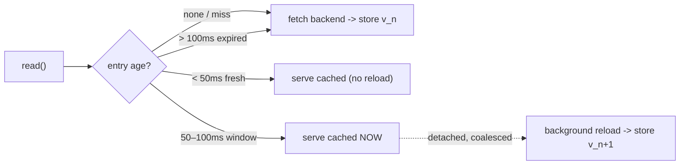

*[Read in English](README.md)*

# Exemple 38 — Cache à rafraîchissement anticipé

Illustre le cache à rafraîchissement anticipé (`WithCache` + `RefreshAhead`) : une
clé chaude est repeinte en arrière-plan juste avant de devenir périmée, de sorte
que les appelants continuent d'obtenir des hits rapides et ne subissent jamais un
miss synchrone à l'expiration (`refreshAfterWrite` de Caffeine).

## Ce que cet exemple illustre

Un simple cache read-through laisse une entrée expirer, et la requête malchanceuse
qui arrive à l'expiration paie la pleine latence du backend. Le rafraîchissement
anticipé comble cet écart. L'exemple suit **une seule clé** sur tout son cycle de
vie face à un TTL frais de 100 ms avec un seuil de rafraîchissement à 50 ms :

1. **Lecture à froid** (âge 0) — un miss ; le seul appel synchrone au backend, qui
   peuple l'entrée à `v1`.
2. **Hit précoce** (âge ~20 ms) — dans le TTL et avant le seuil : un simple hit
   read-through, valeur toujours `v1`, sans rechargement.
3. **Hit vieillissant** (âge ~60 ms) — dans la fenêtre de rafraîchissement
   `[50 ms, 100 ms)` : l'appelant reçoit toujours `v1` **immédiatement** (sans
   pénalité de latence), et un unique rechargement détaché est lancé en
   arrière-plan.
4. **Hit rafraîchi** (après l'arrivée du rechargement) — le rechargement
   d'arrière-plan a écrit `v2` dans le cache ; cette lecture reste un hit et voit
   désormais `v2`.

Le bilan final — un miss, trois hits, deux stores, un rafraîchissement — confirme
que la clé chaude n'est jamais retombée dans un miss synchrone.

## Fonctionnement



## Concepts clés

| Concept | Détail |
|---|---|
| `WithCache(cache, key, ttl, ...)` | Cache read-through : les hits dans le `ttl` court-circuitent entièrement le backend |
| `RefreshAhead(threshold)` | Un hit au-delà de `threshold` mais toujours dans le `ttl` est servi immédiatement *et* déclenche un rechargement d'arrière-plan |
| Rechargement détaché | Le rechargement s'exécute hors de la goroutine de l'appelant, dédupliqué par clé, donc l'appelant n'est jamais bloqué |
| `WithTimeout` (requis) | Le rechargement détaché perd le délai de l'appelant, il lui faut donc sa propre borne (`ErrRefreshAheadWithoutTimeout` sinon) |
| `CacheHits` / `CacheMisses` / `CacheStores` / `CacheRefreshes` | Compteurs qui exposent le comportement du cache ; la fraîcheur est mesurée sur le `Clock` de la politique |

## Quand l'utiliser

- Clés chaudes à débit de lecture régulier, où l'on veut absorber la latence du
  backend hors du chemin de requête plutôt que de la voir surgir à l'expiration.
- Données majoritairement lues qui tolèrent d'être servies quelques millisecondes
  périmées (la valeur en fenêtre) en échange de ne jamais payer un miss synchrone.
- Charges où un miss synchrone déclencherait sinon une ruée d'appels backend
  concurrents lorsqu'une entrée populaire expire.

## Exécution

```bash
go run ./examples/38-cache-refresh-ahead/
```

## Sortie attendue

Quatre lectures montrant la valeur maintenue à `v1` pour la lecture à froid, le hit
précoce et le hit vieillissant, puis basculant vers `v2` une fois le rechargement
d'arrière-plan arrivé. La ligne finale rapporte `hits=3 misses=1 stores=2
refreshes=1`. La sortie est stable car l'exemple pilote le temps avec des pauses
explicites.
