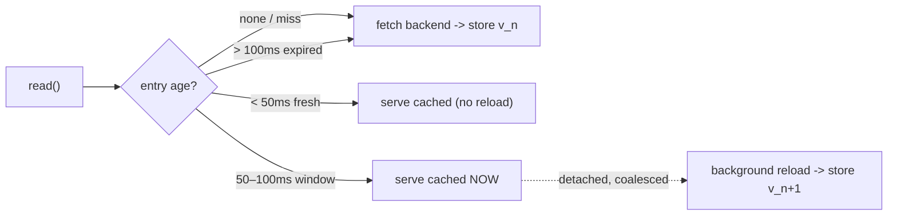

*[Lire en Français](README.fr.md)*

# Example 38 — Refresh-Ahead Cache

Demonstrates refresh-ahead caching (`WithCache` + `RefreshAhead`): a hot key is
repainted in the background just before it would go stale, so callers keep getting
fast hits and never eat a synchronous miss at expiry (Caffeine
`refreshAfterWrite`).

## What it demonstrates

A plain read-through cache lets an entry expire, and the unlucky request that
arrives at expiry pays the full backend latency. Refresh-ahead closes that gap.
The example walks **one key** through its whole lifetime against a 100ms fresh TTL
with a 50ms refresh threshold:

1. **Cold read** (age 0) — a miss; the only synchronous backend hit, populating
   the entry at `v1`.
2. **Early hit** (age ~20ms) — within the TTL and before the threshold: a plain
   read-through hit, value still `v1`, no reload.
3. **Ageing hit** (age ~60ms) — inside the refresh window `[50ms, 100ms)`: the
   caller is still served `v1` **immediately** (no latency penalty), and a single
   detached background reload is fired.
4. **Refreshed hit** (after the reload lands) — the background reload wrote `v2`
   back into the cache; this read is still a hit and now sees `v2`.

The final tally — one miss, three hits, two stores, one refresh — confirms the
hot key never fell through to a synchronous miss.

## How it works



## Key concepts

| Concept | Detail |
|---|---|
| `WithCache(cache, key, ttl, ...)` | Read-through cache: hits within `ttl` skip the backend entirely |
| `RefreshAhead(threshold)` | A hit past `threshold` but still within `ttl` is served immediately *and* triggers a background reload |
| Detached reload | The reload runs off the caller's goroutine, deduplicated per key, so the caller is never blocked |
| `WithTimeout` (required) | The detached reload loses the caller's deadline, so it needs its own bound (`ErrRefreshAheadWithoutTimeout` otherwise) |
| `CacheHits` / `CacheMisses` / `CacheStores` / `CacheRefreshes` | Counters that surface the cache's behaviour; freshness is measured on the policy `Clock` |

## When to use

- Hot keys with a steady read rate, where you want to absorb the backend latency
  off the request path rather than have it surface at expiry.
- Read-mostly data that tolerates being served a few milliseconds stale (the
  in-window value) in exchange for never paying a synchronous miss.
- Workloads where a synchronous miss would otherwise trigger a stampede of
  concurrent backend calls when a popular entry expires.

## Run

```bash
go run ./examples/38-cache-refresh-ahead/
```

## Expected output

Four reads showing the value held at `v1` through the cold read, the early hit,
and the ageing hit, then flipping to `v2` once the background reload lands. The
trailing line reports `hits=3 misses=1 stores=2 refreshes=1`. Output is stable
because the example drives time with explicit sleeps.
