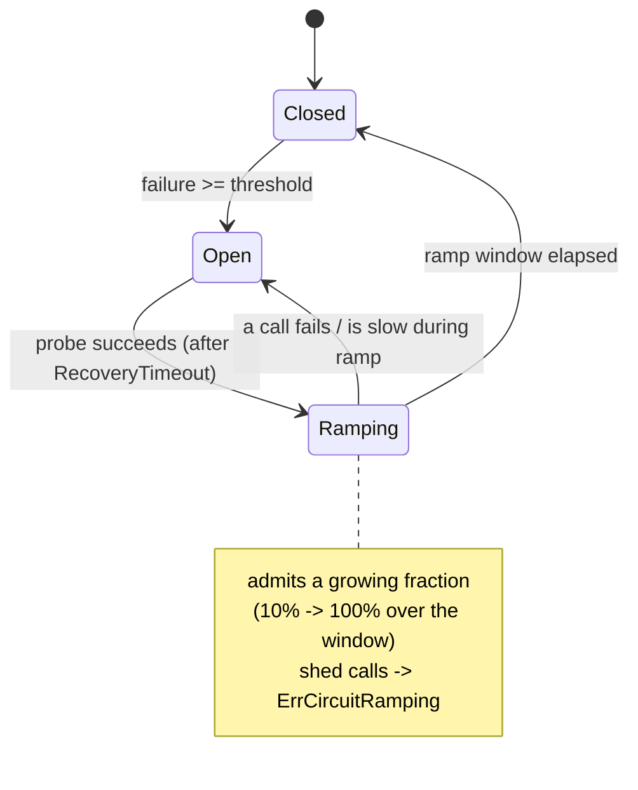

*[Read in English](README.md)*

# Exemple 39 — Reprise progressive (slow-start)

Illustre la reprise progressive du disjoncteur : après le succès de la sonde d'un
disjoncteur déclenché, le trafic est rétabli **graduellement** sur une fenêtre
plutôt que de revenir brutalement à 100 % — réintroduisant en douceur un service
en aval en convalescence (slow-start de l'outlier-detection d'Envoy/Istio).

## Ce que cet exemple illustre

Un service en aval qui vient de se rétablir est généralement encore fragile :
caches froids, pools de connexions froids, runtime à peine réchauffé. Un
disjoncteur qui passe d'ouvert directement à pleine admission peut le submerger à
nouveau dès le premier succès de sonde et se rouvrir aussitôt. `RampRecovery`
admet une fraction **croissante** de trafic sur une fenêtre, afin que le service
en aval se réchauffe sous une charge qui monte progressivement. L'exemple
déroule quatre phases :

1. **Déclenchement** — une panne franchit `FailureThreshold(1)`, le disjoncteur
   s'ouvre (`OnCircuitOpen`) et les appels suivants sont rejetés.
2. **Sonde** — après le `RecoveryTimeout` de 200 ms, le service désormais sain
   laisse une sonde semi-ouverte réussir ; au lieu de se fermer complètement, le
   disjoncteur entre dans l'état `CircuitRamping` (`OnCircuitRamping`).
3. **Montée en charge** — huit rafales de 40 appels réparties sur la fenêtre de
   1 s. La fraction admise grimpe depuis le plancher `RampInitialFraction(0.1)`
   vers 100 % au fil de la fenêtre ; les appels rejetés renvoient
   `ErrCircuitRamping`.
4. **Fermeture** — une fois la fenêtre de montée entièrement écoulée, le
   disjoncteur se ferme (`OnCircuitClose`) et admet tout.

`ErrCircuitRamping` est distinct de `ErrCircuitOpen`, de sorte qu'un appelant peut
différencier « en reprise, réessayez bientôt » de « toujours en panne ».

## Fonctionnement



## Concepts clés

| Concept | Détail |
|---|---|
| `RampRecovery(window)` | Après reprise, monte l'admission de la fraction initiale à 100 % sur `window` au lieu de fermer instantanément |
| `RampInitialFraction(f)` | Plancher de la fraction admise au début de la montée (défaut 0.1) |
| `RampAggression(a)` | Courbe la montée : 1.0 = linéaire, > 1 = plus rapide au début (défaut 1.0) |
| État `CircuitRamping` | Le disjoncteur est en convalescence mais pas encore à pleine charge |
| `ErrCircuitRamping` | Renvoyé pour les appels rejetés pendant la montée — distinct de `ErrCircuitOpen` |
| Jauge `RampRecoveryFraction` | Expose la fraction admise courante ; `OnCircuitRamping` se déclenche à l'entrée |

## Quand l'utiliser

- Services en aval nécessitant un réchauffage après une panne (caches/pools
  froids, warm-up du JIT) et qui se redéclencheraient sous pleine charge dès
  qu'ils semblent sains.
- Tout disjoncteur où un cycle ouvert/fermé instable est pire qu'un rétablissement
  mesuré et graduel du trafic.
- Dépendances sensibles à la capacité où un retour soudain à 100 % serait
  lui-même la cause de la panne suivante.

## Exécution

```bash
go run ./examples/39-ramp-recovery/
```

## Sortie attendue

Les quatre phases dans l'ordre : l'ouverture du disjoncteur, la sonde entrant dans
la montée, puis huit rounds où le nombre admis et la fraction de la jauge grimpent
ensemble de ~10 % à ~100 %, et enfin la fermeture du disjoncteur avec
`ramp transitions=1`. La répartition exacte admis/rejetés par round varie
légèrement car l'admission est probabiliste, mais la tendance à la hausse est
stable.
