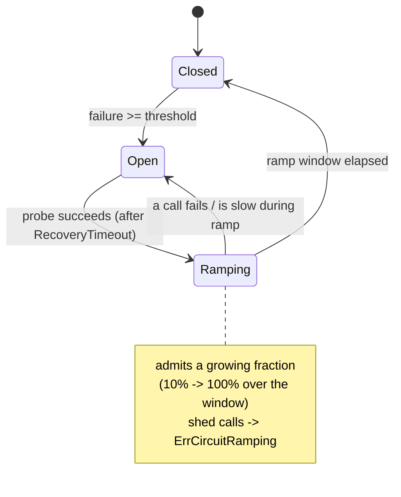

*[Lire en Français](README.fr.md)*

# Example 39 — Slow-Start Ramp Recovery

Demonstrates the circuit breaker's slow-start ramp recovery: after a tripped
breaker's probe succeeds, traffic is restored **gradually** over a window rather
than snapping straight back to 100% — easing a healing downstream back to load
(Envoy/Istio outlier-detection slow-start).

## What it demonstrates

A downstream that just recovered is usually still fragile: cold caches, cold
connection pools, a half-warmed runtime. A breaker that jumps from open straight
to full admission can re-overwhelm it on the very first probe success and flap
back open. `RampRecovery` admits a **growing** fraction of traffic over a window,
so the downstream re-warms under gradually rising load. The example runs four
phases:

1. **Trip** — one failure crosses `FailureThreshold(1)`, the breaker opens
   (`OnCircuitOpen`), and further calls are shed.
2. **Probe** — after the 200ms `RecoveryTimeout`, the now-healthy downstream lets
   a half-open probe succeed; instead of closing fully the breaker enters the
   `CircuitRamping` state (`OnCircuitRamping`).
3. **Ramp** — eight bursts of 40 calls spread across the 1s window. The admitted
   fraction climbs from the `RampInitialFraction(0.1)` floor toward 100% as the
   window elapses; shed calls return `ErrCircuitRamping`.
4. **Close** — once the ramp window has fully elapsed the breaker closes
   (`OnCircuitClose`) and admits everything.

`ErrCircuitRamping` is distinct from `ErrCircuitOpen`, so a caller can tell
"recovering, try again shortly" apart from "still down".

## How it works



## Key concepts

| Concept | Detail |
|---|---|
| `RampRecovery(window)` | After recovery, ramp admission from the initial fraction to 100% over `window` instead of closing instantly |
| `RampInitialFraction(f)` | Floors the admitted fraction at the start of the ramp (default 0.1) |
| `RampAggression(a)` | Curves the ramp: 1.0 = linear, > 1 = faster early (default 1.0) |
| `CircuitRamping` state | The breaker is healing but not yet at full load |
| `ErrCircuitRamping` | Returned for calls shed during the ramp — distinct from `ErrCircuitOpen` |
| `RampRecoveryFraction` gauge | Surfaces the current admitted fraction; `OnCircuitRamping` fires on entry |

## When to use

- Downstreams that need warm-up after an outage (cold caches/pools, JIT warm-up)
  and would re-trip if hit with full load the instant they look healthy.
- Any breaker where a flapping open/closed cycle is worse than a measured,
  gradual restoration of traffic.
- Capacity-sensitive dependencies where a sudden return to 100% would itself be
  the cause of the next outage.

## Run

```bash
go run ./examples/39-ramp-recovery/
```

## Expected output

The four phases in order: the breaker opening, the probe entering the ramp, then
eight rounds where the admitted count and the gauge fraction climb together from
~10% to ~100%, and finally the breaker closing with `ramp transitions=1`. The
exact per-round admitted/shed split varies slightly because admission is
probabilistic, but the upward trend is stable.
