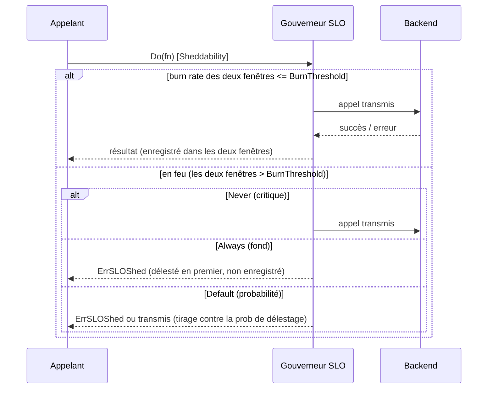

*[Read in English](README.md)*

# Exemple 40 — Gouverneur de burn-rate SLO

Démontre un délesteur piloté par le burn-rate de l'error budget d'un SLO : il
déleste les appels localement en proportion de la vitesse à laquelle l'error
budget d'un objectif *déclaré* se consomme, et il déleste par priorité —
sacrifiant d'abord le travail de fond (sheddable) tout en servant toujours le
travail critique — pour que le budget restant soit dépensé sur les appels qui
comptent.

## Ce que ça démontre

Une policy est configurée avec `WithSLO(0.99, ...)` — un objectif de succès de
99%, soit un error budget de 1%. Le gouverneur surveille le **burn rate** (le taux
d'erreur servi divisé par l'error budget) : `1` consomme le budget au rythme
soutenable, `14.4` est le seuil « fast burn » de Google SRE. Il mesure le burn
rate sur une fenêtre courte et une fenêtre longue et ne déleste que lorsque les
**deux** dépassent `BurnThreshold`.

Une fois engagé, le délestage est appliqué via la `Sheddability` de chaque appel :

- `SheddabilityNever` (critique) — toujours admis, même au burn maximal.
- `SheddabilityDefault` — délesté avec la probabilité `max(0, 1 − BurnThreshold/burnRate)`.
- `SheddabilityAlways` (fond) — délesté dès qu'un délestage est actif.

Un appel délesté localement renvoie `ErrSLOShed`, n'atteint jamais le backend et
n'est jamais enregistré — donc délester le trafic sheddable ne consomme pas
lui-même de budget.

L'exemple fait passer un backend simulé par plusieurs phases :

1. **Sain** — chaque appel réussit, le budget ne brûle pas, rien n'est délesté.
2. **Brownout, trafic default** — le backend échoue à 30% (un burn de ~30x) ; le
   gouverneur déleste la plupart du trafic default.
3. **Brownout, trafic sheddable** — délesté en premier, dès que le délestage est
   actif.
4. **Brownout, trafic critique** — toujours admis, même au burn maximal.
5. **Rétabli** — le backend est sain à nouveau ; une fois les échecs sortis de la
   fenêtre longue, le délestage se résorbe sans reset explicite.

## Comment ça marche



## Concepts clés

| Concept | Détail |
|---|---|
| `WithSLO(target, ...)` | Déleste selon le burn rate de l'error budget SLO, juste à l'extérieur du throttler |
| `BurnThreshold(r)` | Burn rate au-dessus duquel le délestage monte (1 = rythme soutenable) |
| `SLOLongWindow` / `SLOShortWindow` | Les deux doivent dépasser le seuil pour délester (règle multi-fenêtre) |
| `MaxShedRate(r)` | Plafond de la probabilité de délestage, pour toujours sonder un peu |
| `SLOMinRequests(n)` | Plancher de trafic (fenêtre courte) avant tout délestage |
| `WithSheddability` | Marque un appel critique / default / sheddable ; le gouverneur déleste par priorité |
| `OnSLOShed` / `SLOBurnRate` | Hook par appel délesté ; gauge du burn rate courant |
| `ErrSLOShed` | Renvoyé par un appel délesté ; la chaîne interne (et le backend) ne s'exécutent jamais |

## Quand l'utiliser

- Protéger un objectif de niveau de service : délester le travail de basse
  priorité pour garder l'error budget au trafic qui compte quand les échecs
  montent.
- En complément du [throttle adaptatif](../25-adaptive-throttle) : le throttler
  protège un *backend* en difficulté, le gouverneur protège votre *objectif*
  déclaré. Les deux peuvent tourner ensemble.
- Tout client qui classe son trafic (critique vs. fond) et veut sacrifier d'abord
  le travail de fond sous pression de budget.

## Lancer

```bash
go run ./examples/40-slo-governor/
```

## Sortie attendue

Cinq phases. Les phases saine et rétablie transmettent chaque appel avec un burn
rate de `0.0x` et ne délestent rien. Les phases de brownout rapportent un burn
rate bien au-dessus du seuil et une probabilité de délestage proche de `0.90` avec
l'état de santé `slo_burning` : le trafic default est majoritairement délesté, le
trafic sheddable est entièrement délesté, et le trafic critique est entièrement
transmis. Les comptes exacts transmis/délestés pour le trafic default varient
légèrement d'une exécution à l'autre car le délestage est probabiliste.
