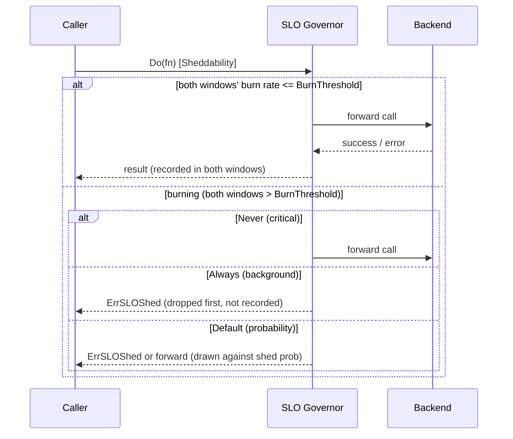

*[Lire en Français](README.fr.md)*

# Example 40 — SLO Burn-Rate Governor

Demonstrates an SLO error-budget burn-rate load shedder: it sheds calls locally
in proportion to how fast a *stated* objective's error budget is burning, and it
sheds by priority — sacrificing background (sheddable) work first while always
serving critical work — so the remaining budget is spent on the calls that
matter.

## What it demonstrates

A policy is configured with `WithSLO(0.99, ...)` — a 99% success objective, i.e. a
1% error budget. The governor watches the **burn rate** (the served error rate
divided by the error budget): `1` spends the budget at the sustainable pace,
`14.4` is the Google-SRE "fast burn" threshold. It measures the burn rate over a
short and a long sliding window and sheds only when **both** exceed
`BurnThreshold`.

When engaged, shedding is applied through each call's `Sheddability`:

- `SheddabilityNever` (critical) — always admitted, even at maximum burn.
- `SheddabilityDefault` — shed with probability `max(0, 1 − BurnThreshold/burnRate)`.
- `SheddabilityAlways` (background) — shed as soon as any shedding is active.

A locally shed call returns `ErrSLOShed`, never reaches the backend, and is never
recorded — so shedding sheddable traffic does not itself burn budget.

The example drives a simulated backend through several phases:

1. **Healthy** — every call succeeds, the budget is not burning, nothing is shed.
2. **Brownout, default traffic** — the backend fails 30% of calls (a ~30x burn);
   the governor sheds most default traffic.
3. **Brownout, sheddable traffic** — dropped first, as soon as shedding is active.
4. **Brownout, critical traffic** — always admitted, even at maximum burn.
5. **Recovered** — the backend is healthy again; once the failures age out of the
   long window, shedding clears with no explicit reset.

## How it works



## Key concepts

| Concept | Detail |
|---|---|
| `WithSLO(target, ...)` | Sheds by SLO error-budget burn rate, just outside the throttler |
| `BurnThreshold(r)` | Burn rate above which shedding ramps (1 = sustainable pace) |
| `SLOLongWindow` / `SLOShortWindow` | Both must exceed the threshold to shed (multiwindow rule) |
| `MaxShedRate(r)` | Cap on the shed probability so some traffic always probes |
| `SLOMinRequests(n)` | Floor of short-window traffic before shedding can engage |
| `WithSheddability` | Marks a call critical / default / sheddable; the governor sheds by priority |
| `OnSLOShed` / `SLOBurnRate` | Hook per shed call; gauge of the current burn rate |
| `ErrSLOShed` | Returned by a shed call; the inner chain (and backend) never run |

## When to use

- Protecting a service-level objective: shed low-priority work to keep the error
  budget for the traffic that matters when failures surge.
- As a complement to the [adaptive throttler](../25-adaptive-throttle): the
  throttler protects a struggling *backend*, the governor protects your stated
  *objective*. They can run together.
- Any client that classifies its traffic (critical vs. background) and wants the
  background work sacrificed first under budget pressure.

## Run

```bash
go run ./examples/40-slo-governor/
```

## Expected output

Five phases. The healthy and recovered phases forward every call with a burn rate
of `0.0x` and shed nothing. The brownout phases report a burn rate well above the
threshold and a shed probability near `0.90` with health state `slo_burning`:
default traffic is mostly shed, sheddable traffic is fully shed, and critical
traffic is fully forwarded. The exact forwarded/shed counts for default traffic
vary slightly from run to run because shedding is probabilistic.
