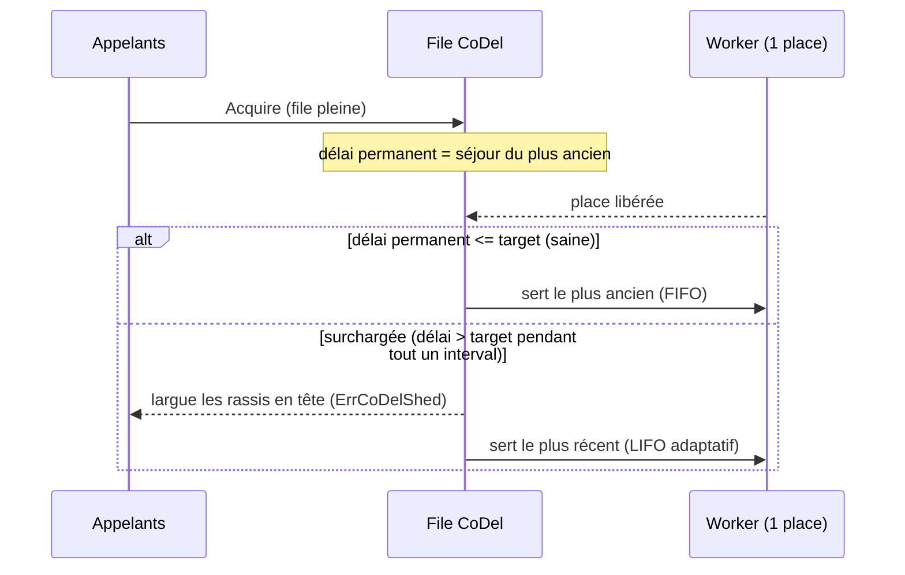

*[Read in English](README.md)*

# Exemple 41 — File à délai contrôlé (CoDel)

Illustre la discipline de file à délai contrôlé sur un bulkhead : au lieu de
larguer sur une échéance fixe par appelant et de servir en FIFO strict, le
bulkhead surveille le *délai de file permanent* et, tant que la file reste
durablement engorgée, largue les appelants qui ont déjà trop attendu et sert les
appelants les plus frais d'abord (LIFO adaptatif).

## Ce qu'il démontre

Un bulkhead à une place est configuré avec `BulkheadCoDel(target, interval)`.
CoDel (RFC 8289, tel qu'adapté par l'exécuteur folly de Facebook) surveille le
temps de séjour de l'appelant **le plus ancien** en file — le délai de file
permanent :

- Tant que ce délai reste inférieur ou égal à `target`, la file est **saine** :
  les appelants sont servis du plus ancien au plus récent (FIFO) et aucun n'est
  largué.
- Une fois que le délai est resté au-dessus de `target` pendant tout un
  `interval`, la file est déclarée **surchargée**. Dès lors, les appelants ayant
  attendu au-delà du délai de largage (`2 × target`) sont largués avec
  `ErrCoDelShed`, et la place libérée est confiée à l'appelant **le plus récent**
  (LIFO adaptatif) — le travail le plus frais et le plus susceptible d'être
  encore attendu, puisque les clients des plus anciens ont probablement abandonné.
- Un seul échantillon revenu au niveau ou en dessous de `target` annule la
  surcharge et rétablit le FIFO.

La démo envoie un flux régulier d'appelants vers le bulkhead à une place derrière
un worker lent (20 ms). La file s'engorge, CoDel verrouille la surcharge, les
appelants rassis en tête sont largués, et les arrivées les plus fraîches
continuent d'être servies.

## Comment ça marche



## Concepts clés

| Concept | Détail |
|---|---|
| `BulkheadCoDel(target, interval)` | Active la discipline à délai contrôlé sur la file d'attente du bulkhead |
| target | Délai de file permanent acceptable ; en dessous la file est saine (défaut folly 5 ms) |
| interval | Durée pendant laquelle le délai doit persister au-dessus de target avant de verrouiller la surcharge (défaut folly 100 ms) |
| délai de largage (`2 × target`) | Un appelant en file au-delà de ce séjour est largué en surcharge |
| LIFO adaptatif | En surcharge le plus récent est servi d'abord ; une file saine reste FIFO |
| `ErrCoDelShed` | Renvoyée à un appelant largué ; distincte de `ErrBulkheadFull` / `ErrBulkheadTimeout` |
| `OnCoDelShed` / `CoDelShed` | Hook par appelant largué ; compteur cumulatif de largages |
| `Overloaded()` / `CoDelLoad` | Si la file est surchargée ; à quel point elle est proche du largage, dans [0,1] |

## Quand l'utiliser

- Une ressource bornée (pool de connexions, pool de workers) précédée d'une file,
  où en surcharge vous préférez abandonner les appelants ayant déjà trop attendu
  — dont les clients ont probablement expiré — plutôt que de les servir rassis.
- Comme alternative plus intelligente à un [`BulkheadMaxWait`](../27-bulkhead-wait)
  fixe : CoDel adapte le point de largage au séjour *observé* au lieu d'une
  échéance statique, et sert le travail le plus frais d'abord sous charge.
- Services sensibles à la latence où garder *certaines* requêtes rapides (LIFO)
  vaut mieux que garder *toutes* les requêtes lentes (FIFO) pendant un engorgement.

## Lancer

```bash
go run ./examples/41-codel-queue/
```

## Sortie attendue

Vingt appelants frappent un bulkhead à une place. Les premiers sont servis avant
que la file ne bascule en surcharge ; ensuite la sortie alterne appelants servis
et largués — les arrivées les plus fraîches (les appelants de numéro élevé près
de chaque libération de place) sont servies tandis que les rassis du milieu sont
largués avec `ErrCoDelShed`. Le résumé rapporte environ un tiers servis et deux
tiers largués. La répartition exacte et les appelants servis varient d'une
exécution à l'autre car le timing est réel.
