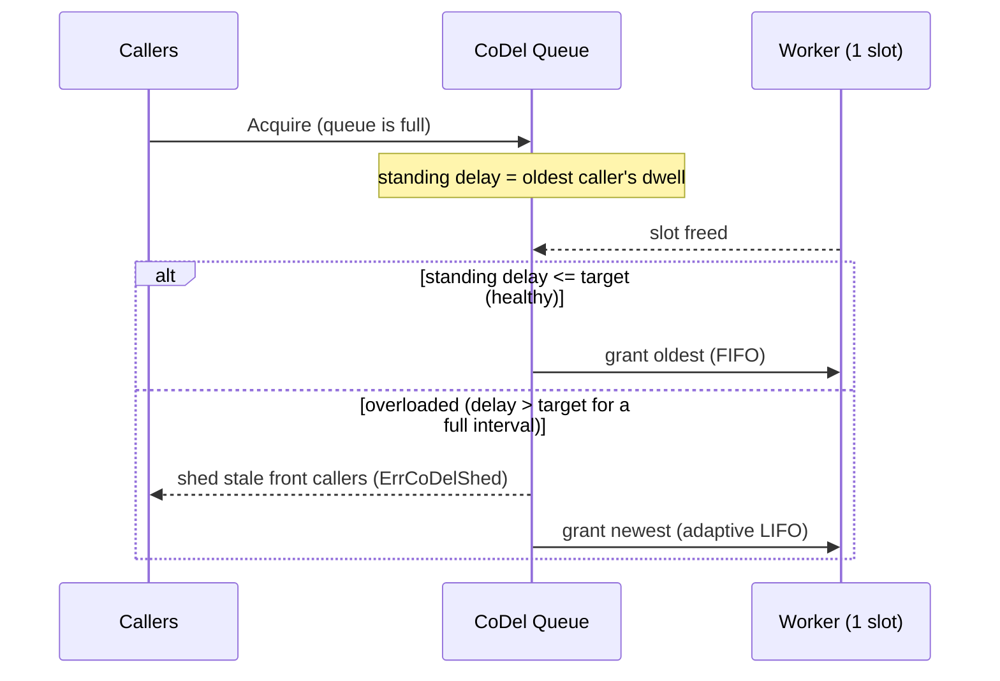

*[Lire en Français](README.fr.md)*

# Example 41 — Controlled-Delay (CoDel) Queue

Demonstrates the controlled-delay queue discipline on a bulkhead: instead of
shedding on a fixed per-caller deadline and serving strictly FIFO, the bulkhead
watches the *standing queue delay* and, while the queue stays persistently backed
up, sheds the callers that have already waited too long and serves the freshest
callers first (adaptive LIFO).

## What it demonstrates

A one-slot bulkhead is configured with `BulkheadCoDel(target, interval)`. CoDel
(RFC 8289, as adapted by Facebook's folly executor) watches the dwell of the
**oldest** queued caller — the standing queue delay:

- While that delay stays at or below `target` the queue is **healthy**: callers
  are served oldest-first (FIFO) and none are shed.
- Once the delay has stayed above `target` for a full `interval`, the queue is
  declared **overloaded**. From then on, callers that have waited past the slough
  timeout (`2 × target`) are shed with `ErrCoDelShed`, and the freed slot is
  handed to the **newest** caller (adaptive LIFO) — the freshest, likeliest-still-
  wanted work, since the clients of the oldest callers have probably given up.
- A single sample back at or below `target` clears the overload and restores FIFO.

The demo fires a steady stream of callers at the one-slot bulkhead behind a slow
(20ms) worker. The queue backs up, CoDel latches overloaded, the stale front
callers are shed, and the freshest arrivals keep getting served.

## How it works



## Key concepts

| Concept | Detail |
|---|---|
| `BulkheadCoDel(target, interval)` | Enables the controlled-delay discipline on the bulkhead's wait queue |
| target | Acceptable standing queue delay; at or below it the queue is healthy (folly default 5ms) |
| interval | How long the delay must persist above target before overload latches (folly default 100ms) |
| slough timeout (`2 × target`) | A queued caller past this dwell is shed while overloaded |
| adaptive LIFO | While overloaded the newest caller is served first; healthy queues stay FIFO |
| `ErrCoDelShed` | Returned to a shed caller; distinct from `ErrBulkheadFull` / `ErrBulkheadTimeout` |
| `OnCoDelShed` / `CoDelShed` | Hook per shed caller; cumulative shed counter |
| `Overloaded()` / `CoDelLoad` | Whether the queue is overloaded; how close it is to shedding, in [0,1] |

## When to use

- A bounded resource (connection pool, worker pool) fronted by a queue, where
  under overload you would rather drop the callers that have already waited too
  long — whose clients have likely timed out — than serve them stale.
- As a smarter alternative to a fixed [`BulkheadMaxWait`](../27-bulkhead-wait):
  CoDel adapts the shed point to the *observed* dwell instead of a static
  deadline, and serves the freshest work first under load.
- Latency-sensitive services where keeping *some* requests fast (LIFO) beats
  keeping *all* requests slow (FIFO) during a backlog.

## Run

```bash
go run ./examples/41-codel-queue/
```

## Expected output

Twenty callers hit a one-slot bulkhead. The first couple are served before the
queue tips overloaded; after that the output interleaves served and shed callers
— the freshest arrivals (the higher-numbered callers near each slot-free) are
served while the stale ones in the middle are shed with `ErrCoDelShed`. The
summary reports roughly a third served and two-thirds shed. The exact split and
which callers are served vary from run to run because the timing is real.
