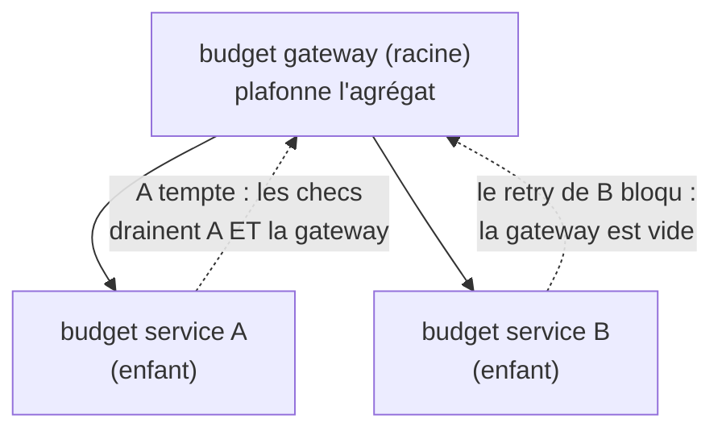

*[Read in English](README.md)*

# Exemple 42 — Budget de retry imbriqué (en arbre)

Illustre un budget de retry imbriqué : des budgets de service arrangés en arbre
sous un budget commun de gateway, de sorte qu'une tempête de retry dans une
feuille draine le parent partagé et bride ses frères — l'amplification de retry ne
peut pas remonter en cascade un graphe d'appels.

## Ce qu'il démontre

Un budget de retry plat par service ([exemple 19](../19-retry-budget)) empêche un
service de tempêter son propre downstream, mais ne fait rien contre l'amplification
*à travers* un graphe d'appels : si une gateway éclate vers plusieurs services et
que chacun a son propre budget sain, une panne corrélée peut quand même laisser
tous les services réessayer en même temps et enterrer une dépendance partagée.

`Parent(*RetryBudget)` imbrique chaque budget de service sous un budget commun de
gateway. Les règles de l'arbre :

- **Les résultats remontent.** Chaque succès/échec enregistré sur un enfant l'est
  aussi sur son parent et tous les ancêtres : un budget parent suit donc la
  pression de retry **agrégée** de tout son sous-arbre (chaque niveau crédite un
  succès selon son propre `TokenRatio`).
- **Un retry exige toute la chaîne.** Un retry n'est permis que si l'enfant **et**
  chaque ancêtre ont encore des tokens au-dessus de la demi-capacité. Un niveau
  épuisé n'importe où sur le chemin vers la racine le bloque.

Ainsi, dès que la pression agrégée draine le budget de gateway, **tout** service du
sous-arbre est bridé — même celui dont le bucket est encore plein. `Exhausted()`
reste **local** (il dit si *ce* bucket est vidé), donc la policy de la gateway
montre la dégradation tandis qu'un frère, bridé seulement par le parent partagé,
lit encore sain — pointant le vrai goulot.

L'exemple câble deux policies de service sous un budget de gateway, tempête la
première, et montre la seconde — saine localement — bridée par le parent partagé
vidé.

## Comment ça marche



## Concepts clés

| Concept | Détail |
|---|---|
| `Parent(*RetryBudget)` | Imbrique un budget sous un autre ; le lien est fixé à la construction et immuable |
| Remontée des résultats | Les succès/échecs d'un enfant sont aussi enregistrés sur chaque ancêtre (parent = agrégat du sous-arbre) |
| AND sur la chaîne | Un retry n'est permis que si l'enfant et chaque ancêtre l'autorisent (court-circuité vers la racine) |
| Bridage des frères | Une tempête dans une feuille draine le parent partagé et bride ses frères |
| `Exhausted()` est local | Dit si *ce* bucket est vidé, donc pointe le niveau goulot (le parent, pas les frères) |
| Code-only | Le lien parent est un graphe d'objets runtime, comme `WithSharedRetryBudget` — non exprimable en config déclarative |

## Quand l'utiliser

- Une gateway ou un agrégateur qui éclate vers plusieurs downstreams, où vous
  voulez un plafond sur la charge de retry *totale* sur tous, pas seulement des
  plafonds par service.
- Tout graphe d'appels multi-niveaux in-process (handler → service → client) où
  une panne corrélée pourrait sinon laisser chaque niveau réessayer en même temps.
- Associer un petit budget par service (protection locale rapide) à un parent
  partagé plus grand (plafond agrégé) dimensionné pour tout le sous-arbre.

## Lancer

```bash
go run ./examples/42-nested-retry-budget/
```

## Sortie attendue

Deux phases. La phase 1 tempête le service A : ses 12 appels en échec drainent à la
fois le budget propre de A (à 0/10) et le budget de gateway partagé (à ~4/20),
tandis que le budget de B reste intact (10/10). La phase 2 fait un seul appel en
échec sur le service B : il n'est **pas** réessayé (1 tentative) car le budget de
gateway partagé est épuisé, même si le budget propre de B est encore sain
(`budgetB.Exhausted()=false`, `gateway.Exhausted()=true`). Les nombres sont
déterministes — le budget est piloté par les résultats d'appel, pas par l'horloge.
