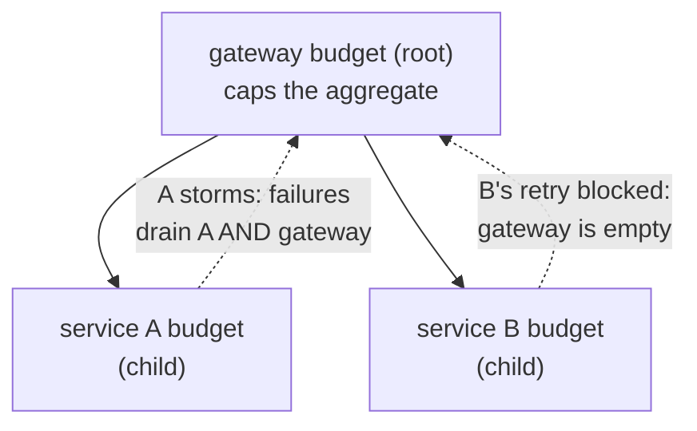

*[Lire en Français](README.fr.md)*

# Example 42 — Nested (Tree) Retry Budget

Demonstrates a nested retry budget: service budgets arranged in a tree under a
gateway-wide budget, so a retry storm in one leaf drains the shared parent and
throttles its siblings — retry amplification cannot cascade up a call graph.

## What it demonstrates

A flat per-service retry budget ([example 19](../19-retry-budget)) stops one
service from storming its own downstream, but it does nothing about amplification
*across* a call graph: if a gateway fans out to many services and each has its own
healthy budget, a correlated outage can still let every service retry at once and
bury a shared dependency.

`Parent(*RetryBudget)` nests each service budget under a gateway-wide budget. The
rules of the tree:

- **Outcomes roll up.** Every success/failure recorded against a child is also
  recorded against its parent and every ancestor, so a parent budget tracks the
  **aggregate** retry pressure of its whole subtree (each level credits a success
  by its own `TokenRatio`).
- **A retry needs the whole chain.** A retry is permitted only when the child
  **and** every ancestor still have tokens above half capacity. An exhausted level
  anywhere on the path to the root blocks it.

So once the aggregate pressure drains the gateway budget, **every** service in the
subtree is throttled — even one whose own bucket is still full. `Exhausted()` stays
**local** (it reports whether *that* bucket is drained), so the gateway's policy
shows the degradation while a sibling, throttled only by the shared parent, still
reads healthy — pinpointing the real bottleneck.

The example wires two service policies under one gateway budget, storms the first,
and shows the second — locally healthy — get throttled by the drained shared parent.

## How it works



## Key concepts

| Concept | Detail |
|---|---|
| `Parent(*RetryBudget)` | Nests a budget under an existing one; the link is set at construction and immutable |
| Outcome roll-up | A child's successes/failures are also recorded against every ancestor (parent = subtree aggregate) |
| AND across the chain | A retry is allowed only if the child and every ancestor allow it (short-circuited up the tree) |
| Sibling throttling | A storm in one leaf drains the shared parent and throttles its siblings |
| `Exhausted()` is local | Reports whether *this* bucket is drained, so it pinpoints the bottleneck level (the parent, not the siblings) |
| Code-only | The parent link is a runtime object graph, like `WithSharedRetryBudget` — not expressible in declarative config |

## When to use

- A gateway or aggregator that fans out to several downstreams, where you want a
  cap on the *total* retry load across all of them, not just per-service caps.
- Any multi-tier in-process call graph (handler → service → client) where a
  correlated outage could otherwise let every tier retry at once.
- Pair a small per-service budget (fast local protection) with a larger shared
  parent (aggregate ceiling) sized for the whole subtree.

## Run

```bash
go run ./examples/42-nested-retry-budget/
```

## Expected output

Two phases. Phase 1 storms service A: its 12 failing calls drain both A's own
budget (to 0/10) and the shared gateway budget (to ~4/20), while service B's
budget is untouched (10/10). Phase 2 makes a single failing call on service B: it
is **not** retried (1 attempt) because the shared gateway budget is exhausted, even
though B's own budget is still healthy (`budgetB.Exhausted()=false`,
`gateway.Exhausted()=true`). The numbers are deterministic — the budget is driven
by call outcomes, not wall-clock time.
