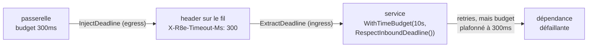

*[Read in English](README.md)*

# Exemple 43 — Propagation de deadline cross-service

Montre comment transporter un deadline *à travers* une frontière de service : une
passerelle inscrit son budget de temps restant sur une requête sortante, et le
service récepteur l'honore — il arrête le travail dès que l'appelant amont n'a
plus de patience.

## Ce que ça démontre

L'[exemple 28](../28-deadline-propagation) montrait la moitié **egress** : un
budget transformé en véritable `ctx.Deadline()` avec `r8e.PropagateDeadline()`.
Mais un deadline n'est utile de bout en bout que si le service *suivant* le lit.
Cet exemple complète la chaîne avec la moitié **ingress**.

Le flux repose sur deux helpers complémentaires du package `httpx` :

- **Egress — `httpx.InjectDeadline(req, clock)`** écrit le budget restant de la
  requête sur une requête HTTP sortante sous forme d'un header relatif en
  millisecondes (`X-R8e-Timeout-Ms`). Une valeur *relative* (et non un timestamp
  absolu) est insensible au décalage d'horloge entre appelant et appelé — la même
  astuce que le `grpc-timeout` de gRPC.
- **Ingress — `httpx.ExtractDeadline(ctx, req)`** relit ce header et reconstruit
  un deadline local (`now + restant`), en renvoyant un contexte borné.

Le service superpose alors `r8e.WithTimeBudget(local, r8e.RespectInboundDeadline())`
sur ce contexte : son budget devient le **plus proche** de son propre plafond
configuré et du deadline entrant (« le plus petit deadline gagne »). Un retry qui
ne peut pas se terminer avant que l'amont n'abandonne n'est jamais lancé.

L'exemple met deux services côte à côte face au même budget de 300ms propagé : un
service **naïf** qui ignore le header (et consomme tout son budget local de 10s) et
un service **deadline-aware** qui l'honore (et s'arrête à ~250ms).

## Comment ça marche



## Concepts clés

| Concept | Détail |
|---|---|
| `httpx.InjectDeadline` | Egress : écrit le budget restant en header ms relatif, insensible au clock-skew (style `grpc-timeout` de gRPC) |
| `httpx.ExtractDeadline` | Ingress : reconstruit `now + restant` en contexte borné ; ignore un header absent/invalide/débordant |
| `RespectInboundDeadline()` | Resserre `WithTimeBudget` au `ctx.Deadline()` entrant — le budget devient `min(local, entrant)` |
| Le plus petit deadline gagne | Un serveur ne fait jamais tourner son budget au-delà du deadline que son appelant a propagé |
| Resserre uniquement | Le clamp ne peut que raccourcir le budget, jamais l'étendre au-delà du plafond configuré |
| Se combine avec `PropagateDeadline()` | Un service intermédiaire honore le deadline amont (ingress) et ré-émet la valeur resserrée en aval (egress) |

## Quand l'utiliser

- Tout service derrière une passerelle ou un agrégateur qui fixe déjà un deadline :
  l'honorer plutôt que retenter un travail dont l'appelant n'attend plus le résultat.
- Les graphes d'appels multi-sauts où le deadline d'origine doit se propager et se
  réduire à chaque saut (passerelle → service → service), chaque maillon honorant
  et ré-émettant.
- Les transports HTTP spécifiquement : gRPC propage `grpc-timeout` automatiquement,
  mais le HTTP simple a besoin de la paire explicite `InjectDeadline`/`ExtractDeadline`.

## Exécution

```bash
go run ./examples/43-deadline-propagation-cross-service/
```

## Sortie attendue

La passerelle propage un budget de 300ms. Le service **naïf** ignore le header et
retente sa dépendance défaillante pendant tout son budget local — ~960ms et 20
tentatives, bien après que la passerelle a abandonné. Le service **deadline-aware**
honore le deadline propagé : son budget est plafonné à ~300ms, il s'arrête donc
après ~250ms et ~6 tentatives. (Les durées exactes varient légèrement selon
l'ordonnancement, mais le service aware s'arrête toujours près du budget de la
passerelle tandis que le naïf le dépasse largement.)
