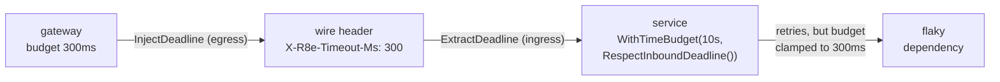

*[Lire en Français](README.fr.md)*

# Example 43 — Cross-Service Deadline Propagation

Demonstrates carrying a deadline *across* a service boundary: a gateway stamps its
remaining time budget onto an outgoing request, and the receiving service honors
it — stopping work the instant the upstream caller has run out of patience.

## What it demonstrates

[Example 28](../28-deadline-propagation) showed the **egress** half: a budget
turned into a real `ctx.Deadline()` with `r8e.PropagateDeadline()`. But a deadline
is only useful end-to-end if the *next* service reads it. This example completes
the chain with the **ingress** half.

The flow has two complementary helpers in the `httpx` package:

- **Egress — `httpx.InjectDeadline(req, clock)`** writes the request's remaining
  budget onto an outgoing HTTP request as a relative millisecond header
  (`X-R8e-Timeout-Ms`). A *relative* value (not an absolute timestamp) is immune
  to clock skew between caller and callee — the same trick gRPC's `grpc-timeout`
  uses.
- **Ingress — `httpx.ExtractDeadline(ctx, req)`** reads that header back and
  reconstructs a local deadline (`now + remaining`), returning a bounded context.

The service then layers `r8e.WithTimeBudget(local, r8e.RespectInboundDeadline())`
on that context: its budget becomes the **sooner** of its own configured ceiling
and the inbound deadline ("the smallest deadline wins"). A retry that cannot
finish before the upstream gave up is never started.

The example stands two services side by side against the same propagated 300ms
budget: a **naive** one that ignores the header (and burns its full 10s local
budget) and a **deadline-aware** one that honors it (and stops at ~250ms).

## How it works



## Key concepts

| Concept | Detail |
|---|---|
| `httpx.InjectDeadline` | Egress: writes the remaining budget as a relative ms header, clock-skew-safe (gRPC `grpc-timeout` style) |
| `httpx.ExtractDeadline` | Ingress: reconstructs `now + remaining` into a bounded context; ignores an absent/invalid/overflowing header |
| `RespectInboundDeadline()` | Tightens `WithTimeBudget` to the inbound `ctx.Deadline()` — the budget becomes `min(local, inbound)` |
| Smallest deadline wins | A server never runs its budget past the deadline its caller propagated |
| Tightens only | The clamp can only ever shorten the budget, never extend it past the configured ceiling |
| Pairs with `PropagateDeadline()` | A middle service honors the upstream deadline (ingress) and re-emits the tightened value downstream (egress) |

## When to use

- Any service behind a gateway or aggregator that already sets a deadline: honor
  it instead of retrying work whose result the caller has stopped waiting for.
- Multi-hop call graphs where the original deadline should cascade and shrink at
  every hop (gateway → service → service), each link both honoring and re-emitting.
- HTTP transports specifically: gRPC propagates `grpc-timeout` automatically, but
  plain HTTP needs the explicit `InjectDeadline`/`ExtractDeadline` pair.

## Run

```bash
go run ./examples/43-deadline-propagation-cross-service/
```

## Expected output

The gateway propagates a 300ms budget. The **naive** service ignores the header
and retries its failing dependency for the full local budget — ~960ms and 20
attempts, long after the gateway gave up. The **deadline-aware** service honors
the propagated deadline: its budget is clamped to ~300ms, so it stops after ~250ms
and ~6 attempts. (Exact timings vary slightly with scheduling, but the aware
service always stops near the gateway budget while the naive one runs far past it.)
