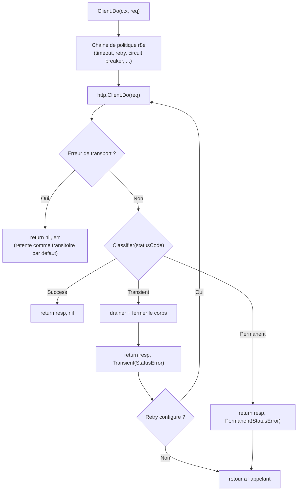

*[Read in English](README.md)*

# httpx — Adaptateur HTTP Client Resilient

Adaptateur leger qui enveloppe un `http.Client` standard avec une politique de
resilience r8e et un classificateur de codes de statut HTTP fourni par
l'utilisateur.

## Ce qu'il fait

- Enveloppe n'importe quel `*http.Client` avec retry, timeout, circuit breaker
  et tous les autres patrons r8e dans un seul `Client` reutilisable.
- Permet de definir quels codes de statut HTTP sont **transitoires**
  (retentables) ou **permanents** (non retentables) via une fonction
  `Classifier`.
- Retourne a la fois le `*http.Response` et l'erreur en cas d'echec, comme
  `http.Client.Do` — l'appelant garde le controle total de la reponse.
- Draine et ferme automatiquement le corps de la reponse sur les erreurs
  transitoires afin que les connexions TCP soient reutilisees lors des
  tentatives.

## Concepts cles

| Concept | Detail |
|---|---|
| `Client` | Enveloppe `http.Client` + `r8e.Policy` + `Classifier` |
| `NewClient` | Constructeur — passer un nom, un client HTTP, un classificateur et des options r8e |
| `Client.Do` | Execute `*http.Request` a travers la politique de resilience |
| `Classifier` | `func(statusCode int) ErrorClass` — associe les codes de statut aux classes d'erreur |
| `ErrorClass` | Enum : `Success`, `Transient`, `Permanent` |
| `StatusError` | Type d'erreur portant le `*http.Response` original pour inspection |

## Flux de requete



## Utilisation

```go
package main

import (
    "context"
    "errors"
    "net/http"
    "time"

    "github.com/byte4ever/r8e"
    "github.com/byte4ever/r8e/httpx"
)

func main() {
    // Definir quels codes sont transitoires vs permanents.
    classifier := func(code int) httpx.ErrorClass {
        switch {
        case code >= 200 && code < 300:
            return httpx.Success
        case code == 429, code == 502, code == 503, code == 504:
            return httpx.Transient
        default:
            return httpx.Permanent
        }
    }

    // Creer un client HTTP resilient.
    client := httpx.NewClient("payment-api",
        http.DefaultClient,
        classifier,
        r8e.WithTimeout(2*time.Second),
        r8e.WithRetry(3, r8e.ExponentialBackoff(100*time.Millisecond)),
        r8e.WithCircuitBreaker(),
    )

    // Utiliser comme http.Client.Do.
    ctx := context.Background()
    req, _ := http.NewRequestWithContext(ctx, http.MethodGet,
        "https://api.example.com/pay", nil)

    resp, err := client.Do(ctx, req)
    if err != nil {
        // Extraire le StatusError pour inspecter la reponse.
        var statusErr *httpx.StatusError
        if errors.As(err, &statusErr) {
            _ = statusErr.Response   // reponse originale
            _ = statusErr.StatusCode // ex. 503
        }
        return
    }
    defer resp.Body.Close()

    // resp.StatusCode est 2xx ici.
}
```

## Gestion des erreurs

Sur les chemins d'erreur, le `*http.Response` est accessible via `errors.As` :

```go
var statusErr *httpx.StatusError
if errors.As(err, &statusErr) {
    // statusErr.Response — reponse HTTP originale
    // statusErr.StatusCode — le code de statut qui a declenche l'erreur
}
```

| Scenario | `resp` | `err` | `StatusError` |
|---|---|---|---|
| 2xx (Success) | non-nil | `nil` | n/a |
| Transitoire (ex. 503) | non-nil | `Transient` | extractible |
| Permanent (ex. 400) | non-nil | `Permanent` | extractible |
| Tentatives epuisees | `nil` | `ErrRetriesExhausted` | extractible (derniere tentative) |
| Erreur de transport | `nil` | erreur de transport | absent |

## Installation

```bash
go get github.com/byte4ever/r8e
```

Le package `httpx` fait partie du module r8e — aucune installation separee
n'est necessaire.
