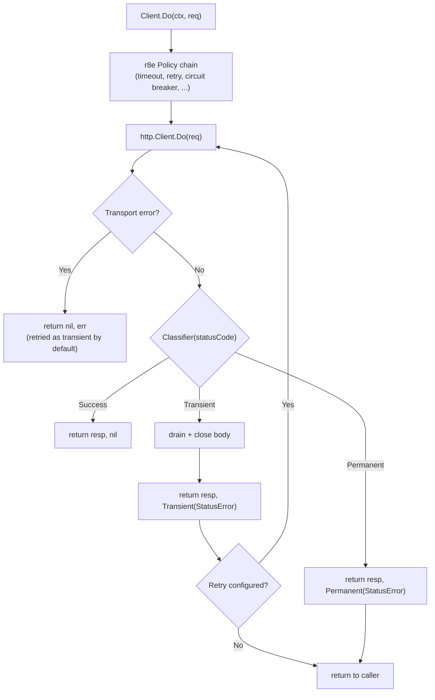

*[Lire en Francais](README.fr.md)*

# httpx — Resilient HTTP Client Adapter

Thin adapter that wraps a standard `http.Client` with an r8e resilience policy
and a user-provided HTTP status code classifier.

## What it does

- Wraps any `*http.Client` with retry, timeout, circuit breaker, and all other
  r8e patterns in a single reusable `Client`.
- Lets you define which HTTP status codes are **transient** (retriable) or
  **permanent** (non-retriable) via a `Classifier` function.
- Returns both the `*http.Response` and the error on failure, just like
  `http.Client.Do` — the caller stays in full control of the response.
- Drains and closes the response body automatically on transient errors so TCP
  connections are reused during retries.

## Key concepts

| Concept | Detail |
|---|---|
| `Client` | Wraps `http.Client` + `r8e.Policy` + `Classifier` |
| `NewClient` | Constructor — pass a name, HTTP client, classifier, and r8e options |
| `Client.Do` | Executes `*http.Request` through the resilience policy |
| `Classifier` | `func(statusCode int) ErrorClass` — maps status codes to error classes |
| `ErrorClass` | Enum: `Success`, `Transient`, `Permanent` |
| `StatusError` | Error type carrying the original `*http.Response` for inspection |

## Request flow



## Usage

```go
package main

import (
    "context"
    "errors"
    "net/http"
    "time"

    "github.com/byte4ever/r8e"
    "github.com/byte4ever/r8e/httpx"
)

func main() {
    // Define which status codes are transient vs permanent.
    classifier := func(code int) httpx.ErrorClass {
        switch {
        case code >= 200 && code < 300:
            return httpx.Success
        case code == 429, code == 502, code == 503, code == 504:
            return httpx.Transient
        default:
            return httpx.Permanent
        }
    }

    // Create a resilient HTTP client.
    client := httpx.NewClient("payment-api",
        http.DefaultClient,
        classifier,
        r8e.WithTimeout(2*time.Second),
        r8e.WithRetry(3, r8e.ExponentialBackoff(100*time.Millisecond)),
        r8e.WithCircuitBreaker(),
    )

    // Use it like http.Client.Do.
    ctx := context.Background()
    req, _ := http.NewRequestWithContext(ctx, http.MethodGet,
        "https://api.example.com/pay", nil)

    resp, err := client.Do(ctx, req)
    if err != nil {
        // Extract the StatusError to inspect the response.
        var statusErr *httpx.StatusError
        if errors.As(err, &statusErr) {
            _ = statusErr.Response   // original response
            _ = statusErr.StatusCode // e.g. 503
        }
        return
    }
    defer resp.Body.Close()

    // resp.StatusCode is 2xx here.
}
```

## Error handling

On error paths, the `*http.Response` is accessible via `errors.As`:

```go
var statusErr *httpx.StatusError
if errors.As(err, &statusErr) {
    // statusErr.Response — original HTTP response
    // statusErr.StatusCode — the status code that triggered the error
}
```

| Scenario | `resp` | `err` | `StatusError` |
|---|---|---|---|
| 2xx (Success) | non-nil | `nil` | n/a |
| Transient (e.g. 503) | non-nil | `Transient` | extractable |
| Permanent (e.g. 400) | non-nil | `Permanent` | extractable |
| Retries exhausted | `nil` | `ErrRetriesExhausted` | extractable (last attempt) |
| Transport error | `nil` | transport error | not present |

## Install

```bash
go get github.com/byte4ever/r8e
```

The `httpx` package is part of the r8e module — no separate install needed.
